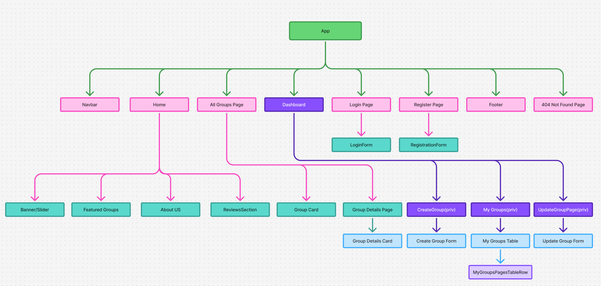

# 🎯 HobbyHub: A Local Hobby Group Organizer

          

🔗 **Live Site:** [https://jhinku-hobbyhub.vercel.app/ ](https://jhinku-hobbyhub.vercel.app/)

HobbyHub is a vibrant, responsive web application designed to connect people through shared hobbies and interests. Whether you're into painting, hiking, gaming, or reading — HobbyHub helps you find or create local groups that match your passion. It’s community-driven, simple to use, and built with scalability in mind.

---

## 🌟 Key Features

🔐 **User Authentication** – Email/password login with Google Auth support. Secure and seamless sign-up and login flow using Firebase.

🏕️ **Join & Create Hobby Groups** – Easily create, manage, or join local hobby-based groups with custom fields like location, category, and start date.

🛡️ **Protected Routes** – Private pages (like "My Groups" and "Create Group") are protected and accessible only to authenticated users.

🎨 **Unique UI/UX** – A distinct design with responsive layouts for desktop, tablet, and mobile screens. Includes dark/light theme toggle.

🧠 **Smart Group Management** – Prevents users from joining inactive/expired groups. Includes update/delete functionality with real-time feedback.

🎥 **Modern Animations** – Uses Lottie animations, React Simple Typewriter, and React Awesome Reveal for engaging visuals.

---

## 📄 Pages & Functionalities

### Public Pages:

- **Home**: Hero banner slider, featured groups, and informative static sections.
- **All Groups**: Browse and explore all available hobby groups.
- **Login/Register**: Email/password login, Google login, with form validation and visual feedback.

### Private Pages (Auth Required):

- **Create Group**: Fill out a form with detailed group info and save to DB.
- **My Groups**: View, update, and delete groups you've created.
- **Group Details**: Full group info with a conditional “Join Group” button based on group start date.
- **Update Group**: Update your group info via a page or optional modal.

---

## 🛠️ Tech Stack

| Category     | Technologies Used                                                                                                                                                                                                                                                                                                                                                                                                                                                                                                                                                                                                 |
| ------------ | ----------------------------------------------------------------------------------------------------------------------------------------------------------------------------------------------------------------------------------------------------------------------------------------------------------------------------------------------------------------------------------------------------------------------------------------------------------------------------------------------------------------------------------------------------------------------------------------------------------------- |
| **Frontend** |        |
| **Backend**  |                                                                                                                                                                                                                                                                                                               |
| **Hosting**  |                                                                                                                                                                                                                                                                                                                                                                                                                                                                                                                                     |

## ✅ Project Highlights

- 💾 15+ Client Commits & 8+ Server Commits
- 📱 Fully Responsive across all devices
- 🚫 No Lorem Ipsum or Default Alerts Used
- 🧪 Toast-based feedback for all auth and group actions
- 🔐 Auth-protected routing without redirect on reload

