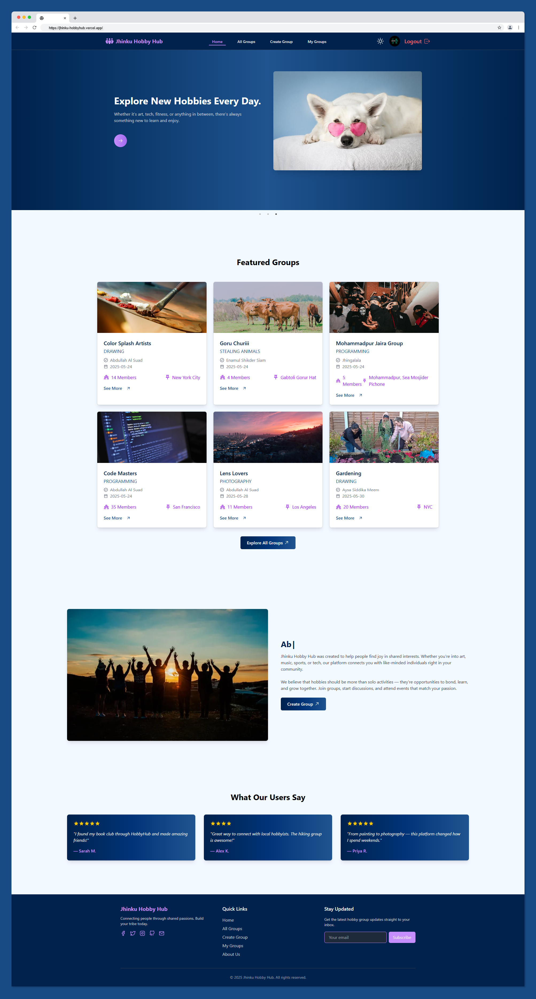

# 🧠 Brain Wave


---

**Brain Wave** is a next-gen knowledge-sharing platform for students and tech enthusiasts. Publish articles, explore trending topics, connect with top contributors, and grow your academic network—all in a beautiful, fast, and responsive app.

---

<p align="center">
  
</p>

## 🚀 Main Features

| Feature                  | Description                                                         |
| ------------------------ | ------------------------------------------------------------------- |
| 📝 Article Publishing    | Create, edit, and manage your own articles with tags and categories |
| 🔒 Secure Authentication | Email/password & Google OAuth login/register                        |
| 🌗 Dark Mode             | Seamless light/dark theme toggle                                    |
| 📊 Personal Dashboard    | Track your articles, likes, and comments                            |
| 🔍 Explore & Search      | Browse featured articles, categories, and top contributors          |
| 💬 Comments & Likes      | Engage with articles through comments and likes                     |
| 📧 Newsletter            | Subscribe for updates                                               |
| ⚡ Responsive UI         | Modern design with React, Tailwind CSS, and Vite                    |

---

## 🛠 Tech Stack

| Category         | Technologies                                                                                                                                                                                                                                                             |
| ---------------- | ------------------------------------------------------------------------------------------------------------------------------------------------------------------------------------------------------------------------------------------------------------------------ |
| **Frontend**     |                                            |
| **Backend/Auth** |                                                                                                                                                                                            |
| **Routing**      |                                                                                                                                                                                  |
| **State**        | React Context API                                                                                                                                                                                                                                                        |
| **UI/UX**        |     |
| **Utils**        |                                                                                                                                                                                                    |
| **Dev Tools**    |                                                                                                                 |

---

## 📦 Key Dependencies

- **react**
- **react-router**
- **tailwindcss**
- **firebase**
- **aos**
- **swiper**
- **react-toastify**
- **lucide-react**
- **eslint**
- **typescript**

See [`package.json`](./package.json) for the full list.

---

## ▶️ Getting Started

1. **Clone the repository:**
   ```sh
   git clone https://github.com/your-username/brainwave-client.git
   cd BrainWave-Client
   ```

2. **Install dependencies:**
   ```sh
   npm install
   ```

3. **Set up environment variables:**
   - Copy `.env.example` to `.env.local` and fill in your Firebase and API keys.

4. **Run the development server:**
   ```sh
   npm run dev
   ```

5. **Open in browser:**
   - Visit [http://localhost:5173](http://localhost:5173)

---

## 📂 Project Structure

```
src/
  components/        # Reusable UI components
  context/           # React Context providers
  firebase/          # Firebase config
  hooks/             # Custom hooks
  pages/             # Main pages (Home, About, Auth, etc.)
  routes/            # App routing
  utils/             # Utilities (date formatting, etc.)
  App.jsx
  main.jsx
public/
index.html
vite.config.js
package.json
```

---

## 🌐 Live Demo

- [Live Site](https://your-live-site-url.vercel.app)
- [Frontend Repository](https://github.com/your-username/brainwave-client)

---

> **Brain Wave** — Empowering students through collaborative knowledge
